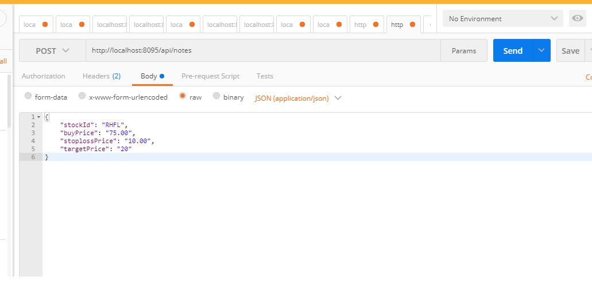
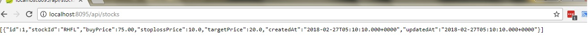

# Stock Tracking Application
This application helps to track stock prices and 
sends emails to users when
* the stock price hits stoploss mark
* the stock price hits target 
* sends list of interesting stock to users (which are having high volume transactions) 

## Requirements
1. Java - 1.8.x
2. Maven - 3.x.x
3. Mysql - 5.x.x

## Technogoies
1. Spring-boot 2.0.0.RC2

## Steps to Setup
**1. Clone the application**
```bash
https://github.com/symanware/stock-tracking-application.git
```

**2. Create Mysql database**
```bash
create database stock_app
```

**3. Change mysql username and password as per your installation**
+ open `src/main/resources/application.properties`
+ change `spring.datasource.username` and `spring.datasource.password` as per your mysql installation

**2. Build and run the app using maven**
```bash
mvn package
java -jar target/stock-tracker-1.0.0.jar
```
Alternatively, you can run the app without packaging it using -
```bash
mvn spring-boot:run
```
The app will start running at <http://localhost:8080>.
## Explore Rest APIs
The app defines following CRUD APIs.
    GET /api/stocks

    POST /api/stocks
    
    GET /api/stocks/{stockId}
    
    PUT /api/stocks/{stockId}
    
    DELETE /api/stocks/{stockId}

You can test them using postman or any other rest client.

* Post stocks 


* get stocks

